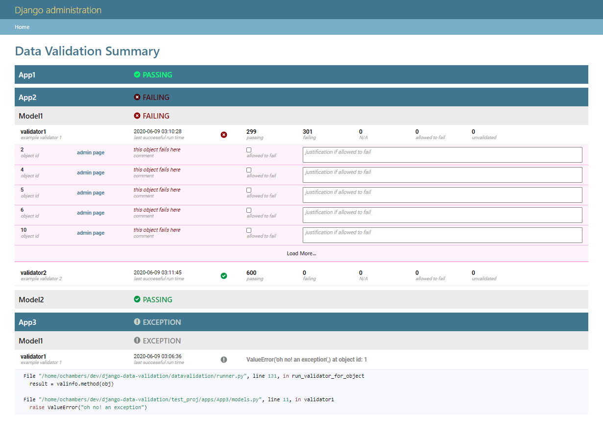
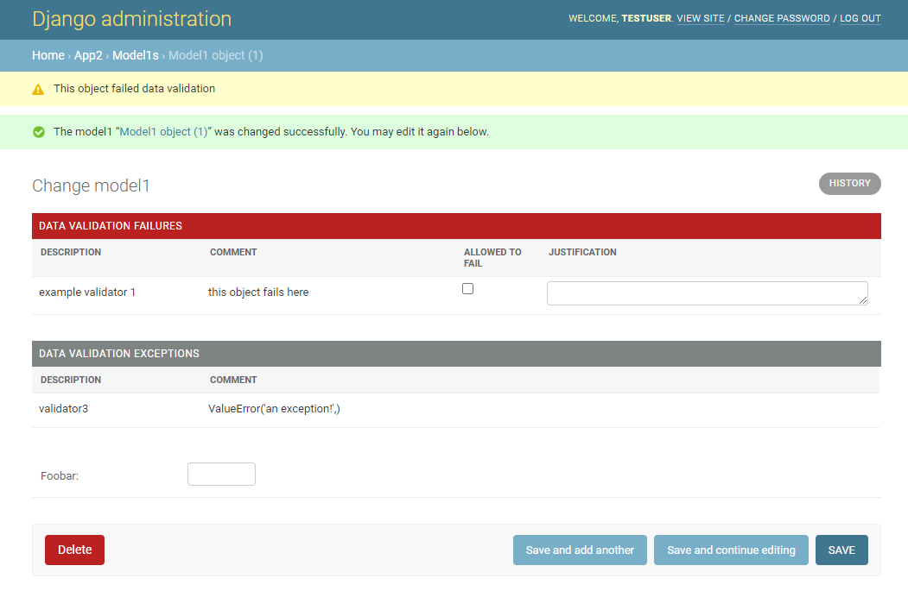

.. role:: sh(code)
    :language: bash

.. role:: py(code)
    :language: python

DJANGO-DATA-VALIDATION
++++++++++++++++++++++

** :warning: this app is still in pre-alpha. expect breaking changes **

A Django app to manage the validation of your data. Inspired by `django-data-tests <https://github.com/andrewbird2/django-data-tests>`_

write tests on your Django models and view the summary in the admin

run the validation when adding/changing an object via django admin

.. include:: ./doc/quickstart.rst

